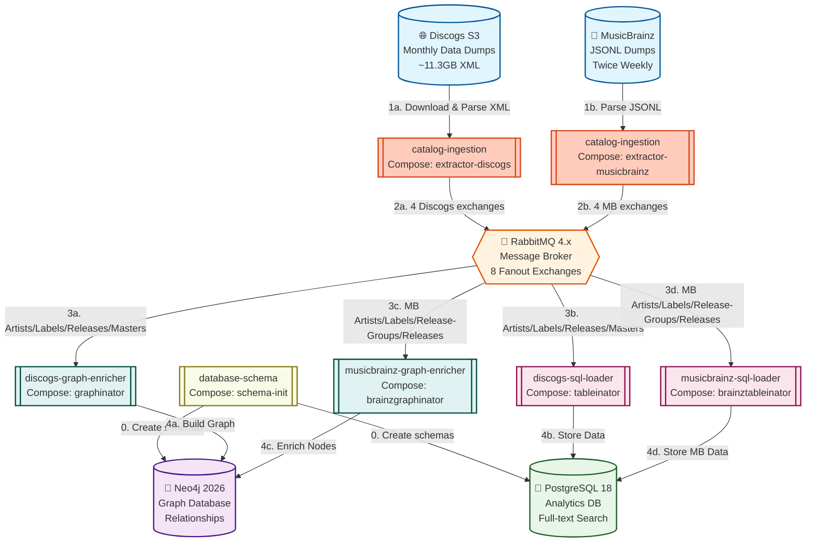
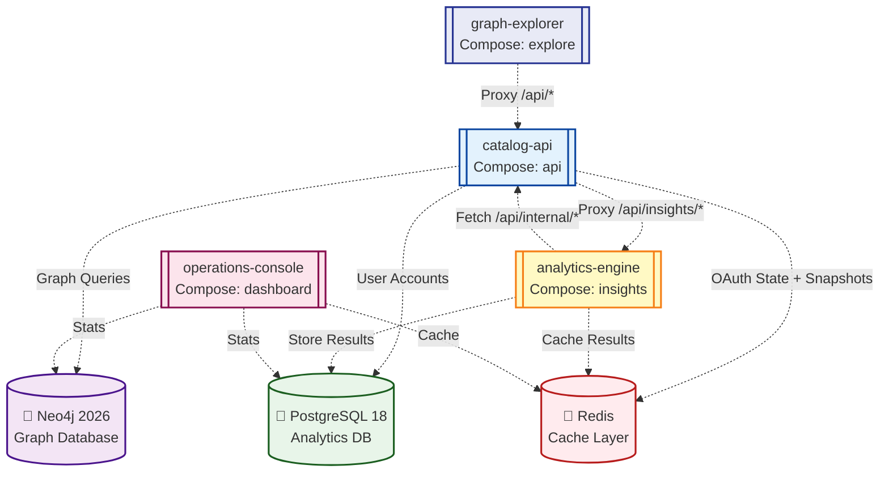
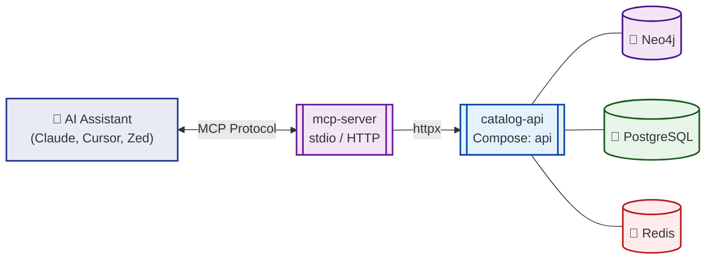
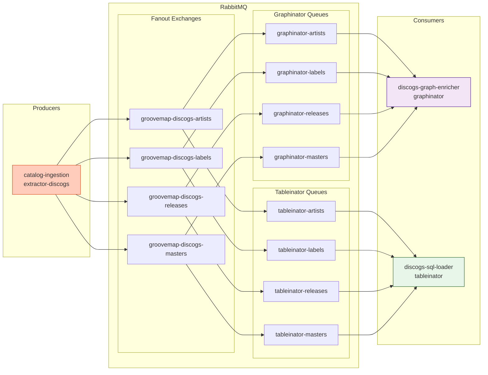
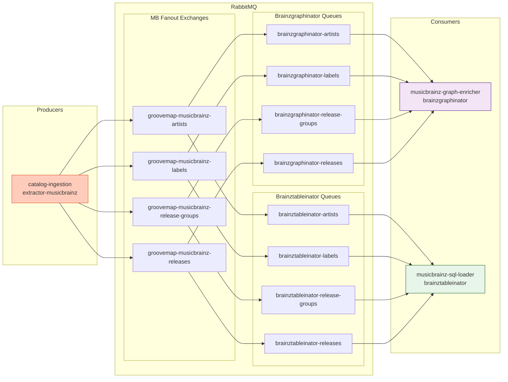
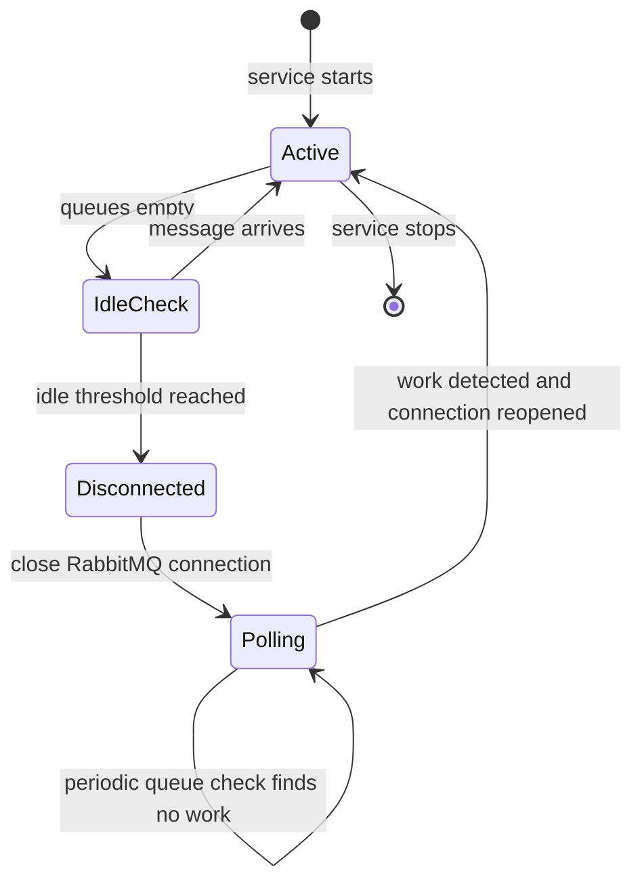

# 🏛️ Architecture Overview

<div align="center">

**Detailed system architecture and component documentation for GrooveMap**

[🏠 Back to Main](../README.md) | [📚 Documentation Index](README.md)

</div>

## Overview

GrooveMap is built as a microservices platform that processes large-scale music data from Discogs and transforms it into queryable knowledge graphs and relational databases. The architecture emphasizes scalability, reliability, and performance.

## Core Services

### Service components

| Source repository | Compose service | Purpose | Port(s) |
| --- | --- | --- | --- |
| [`catalog-api`](https://github.com/groovemap-music/catalog-api) | `api` | User auth, graph queries, and sync triggers | 8004 (external), 8005 |
| [`catalog-ingestion`](https://github.com/groovemap-music/catalog-ingestion) | `extractor-discogs`, `extractor-musicbrainz` | Discogs XML and MusicBrainz JSONL extraction | 8000 (health) |
| [`database-schema`](https://github.com/groovemap-music/database-schema) | `schema-init` | One-shot database schema initialization | — |
| [`discogs-graph-enricher`](https://github.com/groovemap-music/discogs-graph-enricher) | `graphinator` | Build the Discogs-backed Neo4j graph | 8001 (health) |
| [`discogs-sql-loader`](https://github.com/groovemap-music/discogs-sql-loader) | `tableinator` | Load Discogs data into PostgreSQL | 8002 (health) |
| [`graph-explorer`](https://github.com/groovemap-music/graph-explorer) | `explore` | Browser graph exploration application | 8006, 8007 (external) |
| [`operations-console`](https://github.com/groovemap-music/operations-console) | `dashboard` | Runtime monitoring and administration | 8003 (external) |
| [`analytics-engine`](https://github.com/groovemap-music/analytics-engine) | `insights` | Precomputed analytics and music trends | 8008, 8009 (internal) |
| [`mcp-server`](https://github.com/groovemap-music/mcp-server) | Not in this Compose stack | Expose catalog tools to AI assistants | stdio / streamable HTTP |

### MusicBrainz Enrichment Services

| Source repository | Compose service | Purpose | Port(s) |
| --- | --- | --- | --- |
| [`musicbrainz-graph-enricher`](https://github.com/groovemap-music/musicbrainz-graph-enricher) | `brainzgraphinator` | Enrich the Neo4j graph with MusicBrainz metadata | 8011 (health) |
| [`musicbrainz-sql-loader`](https://github.com/groovemap-music/musicbrainz-sql-loader) | `brainztableinator` | Store MusicBrainz data in PostgreSQL | 8010 (health) |

### Infrastructure Components

| Component | Compose service | Purpose | Port(s) |
| --- | --- | --- | --- |
| RabbitMQ | `rabbitmq` | Message broker and queue management | 5672, 15672 |
| Neo4j | `neo4j` | Graph database for relationships | 7474, 7687 |
| PostgreSQL | `postgres` | Relational database for analytics | 5433 (mapped) |
| Redis | `redis` | Cache for queries, sessions, and analytics | 6379 |

Compose service, hostname, container, exchange, and queue names are retained
compatibility identifiers. Canonical product and image identities come from
the source repository names. See the [complete identifier
map](dockerfile-standards.md#compatibility-identifiers).

## System Architecture Diagrams

### Data Pipeline

Shows the ingestion flow from Discogs and MusicBrainz data dumps through extraction, message distribution, and persistence into both databases.



### Service Communication

Shows how user-facing services interact with each other and with the storage layer at runtime.



### Dashboard Monitoring

Shows the Dashboard service's monitoring connections to pipeline services and infrastructure. The Dashboard monitors pipeline services grouped by source (Discogs and MusicBrainz). It does not monitor API, Explore, or Insights health.

```mermaid
graph TD
    DASH[["operations-console<br/>Compose: dashboard"]]

    subgraph Discogs ["Discogs Pipeline"]
        EXT_D[["catalog-ingestion<br/>extractor-discogs"]]
        GRAPH[["discogs-graph-enricher<br/>graphinator"]]
        TABLE[["discogs-sql-loader<br/>tableinator"]]
    end

    subgraph MB ["MusicBrainz Pipeline"]
        EXT_MB[["catalog-ingestion<br/>extractor-musicbrainz"]]
        BGRAPH[["musicbrainz-graph-enricher<br/>brainzgraphinator"]]
        BTABLE[["musicbrainz-sql-loader<br/>brainztableinator"]]
    end

    RMQ{{"🐰 RabbitMQ"}}
    NEO4J[("🔗 Neo4j")]
    PG[("🐘 PostgreSQL")]
    REDIS[("🔴 Redis")]

    DASH -.->|Monitor| EXT_D
    DASH -.->|Monitor| GRAPH
    DASH -.->|Monitor| TABLE
    DASH -.->|Monitor| EXT_MB
    DASH -.->|Monitor| BGRAPH
    DASH -.->|Monitor| BTABLE
    DASH -.->|Stats| RMQ
    DASH -.->|Stats| NEO4J
    DASH -.->|Stats| PG
    DASH -.->|Cache| REDIS

    style DASH fill:#fce4ec,stroke:#880e4f,stroke-width:2px
    style EXT_D fill:#ffccbc,stroke:#d84315,stroke-width:2px
    style EXT_MB fill:#ffccbc,stroke:#d84315,stroke-width:2px
    style GRAPH fill:#e0f2f1,stroke:#004d40,stroke-width:2px
    style TABLE fill:#fce4ec,stroke:#880e4f,stroke-width:2px
    style BGRAPH fill:#e0f2f1,stroke:#004d40,stroke-width:2px
    style BTABLE fill:#fce4ec,stroke:#880e4f,stroke-width:2px
    style RMQ fill:#fff3e0,stroke:#e65100,stroke-width:2px
    style NEO4J fill:#f3e5f5,stroke:#4a148c,stroke-width:2px
    style PG fill:#e8f5e9,stroke:#1b5e20,stroke-width:2px
    style REDIS fill:#ffebee,stroke:#b71c1c,stroke-width:2px
```



### MCP Server Integration

Shows how the MCP server connects AI assistants to the knowledge graph through the API service.



## Data Flow

### 1. Data Extraction Phase

**catalog-ingestion** (Compose services `extractor-discogs` and
`extractor-musicbrainz`, two modes):

- **Discogs mode** (`--source discogs`): Downloads XML dumps from Discogs S3 bucket, high-performance XML parsing (20,000-400,000+ records/sec), SHA256 hash-based deduplication
- **MusicBrainz mode** (`--source musicbrainz`): Parses MusicBrainz JSONL dumps (xz-compressed), extracts Discogs IDs from URL relationships, publishes to MusicBrainz-specific fanout exchanges
- Both modes publish JSON messages to per-data-type RabbitMQ fanout exchanges
- Each mode runs as a separate container with its own state markers

### 2. Message Distribution Phase

**RabbitMQ Fanout Exchanges** (8 total, one per data type per source, decoupled from consumers):

**Discogs exchanges** (4):

- `groovemap-discogs-artists`: Artist and band data
- `groovemap-discogs-labels`: Record label information
- `groovemap-discogs-releases`: Release records
- `groovemap-discogs-masters`: Master recording data

**MusicBrainz exchanges** (4):

- `groovemap-musicbrainz-artists`: MusicBrainz artist data with Discogs cross-references
- `groovemap-musicbrainz-labels`: MusicBrainz label data with Discogs cross-references
- `groovemap-musicbrainz-release-groups`: MusicBrainz release-group data with Discogs master cross-references
- `groovemap-musicbrainz-releases`: MusicBrainz release data with Discogs cross-references

Each consumer independently declares and binds its own queues to these exchanges.

**Message Types**:

- `data` — Individual records with SHA256 hash
- `file_complete` — Sent per data type when a file finishes processing
- `extraction_complete` — Sent once to all 4 exchanges after all files finish, carrying `started_at` timestamp and per-type record counts

```json
{
  "type": "data",
  "id": "<record_id>",
  "sha256": "<64-char hex hash>",
  ...entity-specific fields
}
```

See [Database Schema — Extractor Message Format](https://github.com/groovemap-music/database-schema) for detailed examples.

### 3. Data Persistence Phase

**discogs-graph-enricher** (Compose service `graphinator`, Neo4j):

- Consumes messages from all 4 queues
- Creates nodes: Artist, Label, Release, Master, Genre, Style
- Builds relationships: BY, ON, MEMBER_OF, DERIVED_FROM, etc.
- On `extraction_complete`: deletes stub nodes (no `sha256` property) created by cross-type MERGE operations
- **Post-import computation** (after releases complete): Runs `compute_genre_style_stats()` to pre-compute aggregate properties on Genre and Style nodes (release_count, artist_count, label_count, style_count/genre_count, first_year). Uses `CALL {} IN TRANSACTIONS OF 1 ROWS` to process each node in its own transaction (avoids 120s timeout for mega-genres like Rock/Electronic). These properties replace expensive runtime traversals (~200M DB hits → 6 DB hits per query).

**discogs-sql-loader** (Compose service `tableinator`, PostgreSQL):

- Consumes messages from all 4 queues
- Stores JSONB documents in relational tables; always refreshes `updated_at`, only rewrites data when hash differs
- Creates indexes for fast queries
- On `extraction_complete`: purges stale rows where `updated_at < started_at`

See [Database Schema — Post-Extraction Cleanup](https://github.com/groovemap-music/database-schema) for details.

### 3b. MusicBrainz Enrichment Phase

**musicbrainz-graph-enricher** (Compose service `brainzgraphinator`, Neo4j):

- Consumes messages from 4 MusicBrainz queues (artists, labels, release-groups, releases)
- Enriches existing Discogs nodes with `mb_`-prefixed properties (type, gender, dates, area, disambiguation)
- Creates 8 new relationship edge types between Discogs-matched entities (COLLABORATED_WITH, TAUGHT, TRIBUTE_TO, FOUNDED, SUPPORTED, SUBGROUP_OF, RENAMED_TO, enriched MEMBER_OF)
- All MB-sourced edges carry `source: 'musicbrainz'` for provenance tracking
- Skips entities without a Discogs match — only enriches nodes already in the graph
- Idempotent: `MATCH...SET` for metadata, `MERGE` for edges — safe for re-import

**musicbrainz-sql-loader** (Compose service `brainztableinator`, PostgreSQL):

- Consumes messages from 4 MusicBrainz queues (artists, labels, release-groups, releases)
- Stores **all** MusicBrainz entities in the `musicbrainz` PostgreSQL schema — including entities without Discogs matches
- Records artist-to-artist relationships (collaborations, band membership, etc.)
- Stores external links (Wikipedia, Wikidata, AllMusic, Last.fm, IMDb)
- Idempotent via `ON CONFLICT DO UPDATE/NOTHING`

See [MusicBrainz Sync Guide](https://github.com/groovemap-music/musicbrainz-graph-enricher/blob/main/docs/musicbrainz-sync.md) for operational instructions.

### 4. Query and Analytics Phase

**API Service** (graph query endpoints):

- Interactive graph exploration (`/api/explore`, `/api/expand`)
- Trend analysis and pattern discovery (`/api/trends`)
- Entity autocomplete and node detail lookup (`/api/autocomplete`, `/api/node/{id}`)
- User collection and wantlist queries (`/api/user/collection`, `/api/user/wantlist`)
- Collection gap analysis (`/api/collection/gaps/label/{id}`, `/api/collection/gaps/artist/{id}`, `/api/collection/gaps/master/{id}`)
- Graph snapshot save/restore (`/api/snapshot`)

**API Service** (new feature endpoints):

- Path finder (`/api/path`)
- Unified full-text search (`/api/search`)
- Label DNA fingerprinting and comparison (`/api/label/{label_id}/dna`, `/api/label/{label_id}/similar`, `/api/label/dna/compare`)
- Taste fingerprint analytics (`/api/user/taste/*`)
- Time-travel filtering (`/api/explore/year-range`, `/api/explore/genre-emergence`, `before_year` parameter on `/api/expand`)
- Collection timeline evolution (`/api/user/collection/timeline`, `/api/user/collection/evolution`)
- Recommendation engine (`/api/recommend/similar/artist/{artist_id}` — find similar artists via shared genres/styles, `/api/recommend/explore/{entity_type}/{entity_id}` — explore-from-here discovery)
- Collaborator network (`/api/collaborators/{artist_id}` — artists sharing releases, with temporal breakdown)
- Collaboration network analysis (`/api/network/artist/{id}/collaborators` — multi-hop collaborator traversal, `/api/network/artist/{id}/centrality` — degree and collaboration centrality, `/api/network/cluster/{id}` — community detection via genre clustering)
- Genre tree hierarchy (`/api/genre-tree` — genre/style tree derived from release co-occurrence)
- Graph statistics (`/api/graph/stats` — aggregate node counts across all entity types)
- MusicBrainz enrichment status (`/api/enrichment/status` — coverage statistics for MB-enriched entities)
- MusicBrainz artist metadata (`/api/musicbrainz/artist/{artist_id}` — MB properties for a Discogs artist)
- MusicBrainz artist relationships (`/api/musicbrainz/artist/{artist_id}/relationships` — MB-sourced edges)
- MusicBrainz artist external links (`/api/musicbrainz/artist/{artist_id}/external-links` — Wikipedia, Wikidata, etc.)

**MCP Server** (AI assistant integration):

- Thin HTTP client that proxies all 12 tools through the API service — no direct database access
- Tools: search, entity details (artist/label/release/genre/style), path finder, trends, graph stats, collaborators, genre tree, natural-language query
- Transports: stdio (Claude Desktop, Cursor, Zed) or streamable-http (hosted)

**Insights Service** (precomputed analytics):

- Scheduled batch analytics fetched from API internal endpoints over HTTP (configurable interval, default: 24h)
- Top artists by graph centrality (`/api/insights/top-artists`)
- Genre trends by decade (`/api/insights/genre-trends`)
- Label longevity rankings (`/api/insights/label-longevity`)
- Monthly release anniversaries (`/api/insights/this-month`)
- Data completeness scores (`/api/insights/data-completeness`)
- Computation status monitoring (`/api/insights/status`)

**Why insights needs a shared secret** (`INSIGHTS_INTERNAL_SECRET`):

Insights holds no database credentials — it never connects to Neo4j. Every request involving it makes two hops through the API service:

1. **Public hop** — a user calls `/api/insights/*` on the API, which proxies to the insights container.
2. **Internal hop** — insights computes its analytics by calling back to `/api/internal/insights/*` on the API, which runs the actual Neo4j aggregate queries.

The `internal` prefix on hop 2 is only a URL path: those routes live on the **same listener** as the public API, and the API is the one service intentionally exposed outside the stack. Without a credential, any internet client — or any other container on the compose network — could invoke the internal endpoints directly and run heavy, unauthenticated Neo4j aggregates, bypassing the public API's auth and rate limits. `INSIGHTS_INTERNAL_SECRET` is the service-to-service password that closes this: the API requires it on every `/api/internal/insights/*` call, and insights is the only other holder. Both services must therefore see the **same value** (in production, one Docker secret file mounted into both — see [configuration.md](configuration.md)). Network isolation alone was rejected as the boundary because a single compromised container would otherwise get unrestricted graph access; the shared secret is the defense-in-depth layer, provisioned like every other credential via `scripts/create-secrets.sh`.

**Explore Service** (static frontend):

- Serves the D3.js force-directed graph UI and Plotly.js trends frontend
- All graph query API calls are made from the browser to the **API service** (port 8004)

**Dashboard Service**:

- Real-time WebSocket updates
- System health monitoring
- Queue metrics and processing rates
- Interactive visualizations

## Component Details

### catalog-ingestion (`extractor-*`)

**Responsibilities**:

- **Discogs mode** (`--source discogs`): Download XML dumps from S3, parse, deduplicate, publish to 4 fanout exchanges
- **MusicBrainz mode** (`--source musicbrainz`): Parse JSONL dumps, extract Discogs IDs, publish to 4 fanout exchanges
- Validate checksums and metadata
- Track progress via version-specific state markers

**Key Features**:

- Async Rust with Tokio runtime
- 20,000-400,000+ records/sec processing (Discogs XML)
- Memory-efficient streaming parsers for both XML and JSONL
- Periodic update checks (configurable interval)
- Smart file completion tracking
- Automatic retry with exponential backoff
- Separate state markers per source: `.extraction_status_*.json` (Discogs) and `.mb_extraction_status_*.json` (MusicBrainz)

**Configuration**:

- `DISCOGS_ROOT` / `MUSICBRAINZ_ROOT`: Data storage directories
- `PERIODIC_CHECK_DAYS`: Update check interval
- `RABBITMQ_HOST`: RabbitMQ hostname
- `RABBITMQ_USERNAME`, `RABBITMQ_PASSWORD`: RabbitMQ auth credentials
- `DISCOGS_EXCHANGE_PREFIX`: Exchange name prefix (default: `groovemap-discogs` for Discogs, `groovemap-musicbrainz` for MB)

Each source owns its own producer repository and image:
[`discogs-ingestion`](https://github.com/groovemap-music/discogs-ingestion) and
[`musicbrainz-ingestion`](https://github.com/groovemap-music/musicbrainz-ingestion).
See the matching README for details.

### Database schema initializer

**Responsibilities**:

- Create all Neo4j constraints and indexes on first run
- Create all PostgreSQL tables and indexes on first run
- Run as a one-shot init container before any other service starts
- All DDL uses `IF NOT EXISTS` — safe to re-run, never drops schema objects

**Key Features**:

- Idempotent: re-running on an already-initialized database is a no-op
- Single source of truth for both Neo4j and PostgreSQL schema definitions
- Schema definitions are owned by the `database-schema` repository in
  [`src/groovemap_schema/neo4j.py`](https://github.com/groovemap-music/database-schema/blob/main/src/groovemap_schema/neo4j.py)
  and [`src/groovemap_schema/postgres.py`](https://github.com/groovemap-music/database-schema/blob/main/src/groovemap_schema/postgres.py)
- Parallel initialization: Neo4j and PostgreSQL schema creation run concurrently
- Exits 0 on success, 1 on any failure (so dependent services will not start)

**Configuration**:

- `NEO4J_HOST`, `NEO4J_USERNAME`, `NEO4J_PASSWORD`: Neo4j connection
- `POSTGRES_HOST`, `POSTGRES_USERNAME`, `POSTGRES_PASSWORD`, `POSTGRES_DATABASE`: PostgreSQL connection

See the [database-schema repository](https://github.com/groovemap-music/database-schema) for source and release details.

### discogs-graph-enricher (`graphinator`)

**Responsibilities**:

- Build Neo4j knowledge graph
- Create nodes and relationships
- Maintain graph indexes
- Handle schema evolution
- Pre-compute aggregate statistics on Genre/Style nodes after release import

**Key Features**:

- Automatic relationship detection
- Batch transaction processing
- Connection resilience with retry logic
- Smart consumer lifecycle management
- **Post-import aggregation**: `compute_genre_style_stats()` sets 5 pre-computed properties (release_count, artist_count, label_count, style_count/genre_count, first_year) on each Genre and Style node using `CALL {} IN TRANSACTIONS OF 1 ROWS`

**Configuration**:

- `NEO4J_HOST`: Neo4j bolt URL
- `NEO4J_USERNAME`, `NEO4J_PASSWORD`: Auth credentials
- `CONSUMER_CANCEL_DELAY`: Idle timeout before shutdown

See [Graphinator README](https://github.com/groovemap-music/discogs-graph-enricher/blob/main/graphinator/README.md) for details.

### discogs-sql-loader (`tableinator`)

**Responsibilities**:

- Store data in PostgreSQL
- Create and maintain indexes
- Handle JSONB documents
- Enable full-text search

**Key Features**:

- JSONB for flexible schema
- GIN indexes for fast queries
- Batch insert optimization
- Connection pool management

**Configuration**:

- `POSTGRES_HOST`: PostgreSQL host:port
- `POSTGRES_USERNAME`, `POSTGRES_PASSWORD`: Auth credentials
- `POSTGRES_DATABASE`: Database name

See [Tableinator README](https://github.com/groovemap-music/discogs-sql-loader/blob/main/tableinator/README.md) for details.

### Brainzgraphinator

**Responsibilities**:

- Enrich existing Neo4j nodes with MusicBrainz metadata
- Create new relationship edges between Discogs-matched entities
- Track enrichment statistics (entities enriched, skipped, relationships created)

**Key Features**:

- Enriches Artist, Label, Release, and Master nodes with `mb_`-prefixed properties (mbid, type, gender, dates, area, disambiguation, secondary_types, first_release_date)
- Creates 8 relationship edge types: MEMBER_OF (enriched), COLLABORATED_WITH, TAUGHT, TRIBUTE_TO, FOUNDED, SUPPORTED, SUBGROUP_OF, RENAMED_TO
- All MB-sourced edges carry `source: 'musicbrainz'` provenance
- Discogs-matched entities only — skips entities without a Discogs ID in the MB data
- Both sides required for edges — relationships only created when both entities exist in Neo4j
- Smart connection lifecycle: auto-close when idle, periodic queue checks, auto-reconnect
- Idempotent writes: safe for re-import

**Configuration**:

- `NEO4J_HOST`, `NEO4J_USERNAME`, `NEO4J_PASSWORD`: Neo4j connection
- `RABBITMQ_HOST`, `RABBITMQ_USERNAME`, `RABBITMQ_PASSWORD`: RabbitMQ connection
- `CONSUMER_CANCEL_DELAY`: Idle timeout before consumer cancellation (default: 300s)

See [Brainzgraphinator README](https://github.com/groovemap-music/musicbrainz-graph-enricher/blob/main/brainzgraphinator/README.md) for details.

### Brainztableinator

**Responsibilities**:

- Store all MusicBrainz data in PostgreSQL `musicbrainz` schema
- Record entity relationships and external links
- Maintain data integrity with MBID-based primary keys

**Key Features**:

- Stores artists, labels, release-groups, and releases with structured columns plus JSONB `data` for full record
- Records relationships (collaborations, band membership, etc.) with source/target MBIDs
- Stores external links (Wikipedia, Wikidata, AllMusic, Last.fm, IMDb) per entity
- Stores **all** entities — including those without Discogs matches (available for future use)
- `ON CONFLICT DO UPDATE/NOTHING` for idempotent processing
- Smart connection lifecycle: auto-close when idle, periodic queue checks, auto-reconnect

**Configuration**:

- `POSTGRES_HOST`, `POSTGRES_USERNAME`, `POSTGRES_PASSWORD`, `POSTGRES_DATABASE`: PostgreSQL connection
- `RABBITMQ_HOST`, `RABBITMQ_USERNAME`, `RABBITMQ_PASSWORD`: RabbitMQ connection
- `CONSUMER_CANCEL_DELAY`: Idle timeout before consumer cancellation (default: 300s)

See [Brainztableinator README](https://github.com/groovemap-music/musicbrainz-sql-loader/blob/main/brainztableinator/README.md) for details.

### graph-explorer (`explore`)

**Responsibilities**:

- Serve the interactive graph exploration frontend (Tailwind CSS, Alpine.js, D3.js, Plotly.js)
- Provide a health check endpoint
- All graph query API endpoints are routed through the **API service**

**Key Features**:

- FastAPI static file serving (HTML, JS, CSS)
- Tailwind CSS dark theme with Alpine.js reactive UI
- D3.js force-directed graph and Plotly.js trends visualizations
- Exposed on host ports 8006 (frontend) and 8007 (health check) in Docker Compose

**Configuration**:

- `API_BASE_URL`: URL of the API service to proxy graph query requests (default: `http://api:8004`)
- `CORS_ORIGINS`: Optional comma-separated list of allowed CORS origins

See [Explore README](https://github.com/groovemap-music/graph-explorer) for details.

### operations-console (`dashboard`)

**Responsibilities**:

- Real-time system monitoring
- WebSocket-based live updates
- Service health checks
- Queue metrics visualization
- Admin panel (login-gated) for extraction management and DLQ operations

**Key Features**:

- FastAPI backend
- WebSocket for real-time data
- Responsive HTML/CSS/JS frontend
- Activity log and event tracking
- Admin proxy router — forwards authenticated admin requests to the API service
- Extraction trigger (forces full reprocessing) and history table
- Dead-letter queue purge interface

**Configuration**:

- Service health endpoint URLs
- Database connection strings
- RabbitMQ management API access
- `API_HOST` / `API_PORT` — API service connection for admin proxy

See [Dashboard README](https://github.com/groovemap-music/operations-console) for details.

### analytics-engine (`insights`)

**Responsibilities**:

- Run scheduled batch analytics by fetching raw query data from the API service over HTTP
- Compute artist centrality, genre trends, label longevity, anniversaries, data completeness, community enrichment, and release rarity
- Store precomputed results in PostgreSQL `insights.*` tables
- Serve analytics via read-only HTTP endpoints

**Key Features**:

- FastAPI backend with async PostgreSQL and httpx (API client)
- Configurable scheduler interval (default: 24 hours)
- 7 computation types running sequentially
- Redis caching with cache-aside pattern (TTL matches schedule interval, invalidated after computation)
- Separate health server on port 8009
- Results proxied through the API service at `/api/insights/*`

**Configuration**:

- `API_BASE_URL`: URL of the API service for fetching raw query data over HTTP
- `POSTGRES_HOST`, `POSTGRES_USERNAME`, `POSTGRES_PASSWORD`, `POSTGRES_DATABASE`: PostgreSQL connection
- `INSIGHTS_SCHEDULE_HOURS`: Computation interval in hours (default: 24)
- `REDIS_HOST`: Redis hostname for result caching
- `INSIGHTS_MILESTONE_YEARS`: Configurable anniversary years to highlight

See [Insights README](https://github.com/groovemap-music/analytics-engine) for details.

### catalog-api (`api`)

**Responsibilities**:

- User registration and authentication (`/api/auth/*`)
- Self-service password reset with Redis-backed tokens (`/api/auth/reset-*`)
- Optional TOTP two-factor authentication (`/api/auth/2fa/*`)
- JWT token generation and validation (HS256)
- Discogs OAuth 1.0a OOB flow management (`/api/oauth/*`)
- Discogs OAuth token storage and retrieval
- Graph query endpoints (`/api/autocomplete`, `/api/explore`, `/api/expand`, `/api/node/{id}`, `/api/trends`)
- User collection and wantlist queries (`/api/user/collection`, `/api/user/wantlist`, `/api/user/recommendations`, `/api/user/collection/stats`, `/api/user/status`)
- Collection gap analysis (`/api/collection/gaps/{type}/{id}`, `/api/collection/formats`)
- Collection and wantlist sync (`/api/sync`, `/api/sync/status`)
- Graph snapshot save/restore (`/api/snapshot`, `/api/snapshot/{token}`)
- Recommendation endpoints (`/api/recommend/similar/artist/{artist_id}`, `/api/recommend/explore/{entity_type}/{entity_id}`)
- Label DNA endpoints (`/api/label/{id}/dna`, `/api/label/{id}/similar`, `/api/label/dna/compare`)
- Taste fingerprint endpoints (`/api/user/taste/*`)
- Unified full-text search (`/api/search`)
- Collection timeline and evolution (`/api/user/collection/timeline`, `/api/user/collection/evolution`)
- Time-travel endpoints (`/api/explore/year-range`, `/api/explore/genre-emergence`)
- Path finder (`/api/path`)
- Reads Discogs app credentials from `app_config` table (set via `discogs-setup` CLI)

**Key Features**:

- FastAPI backend with async PostgreSQL
- PBKDF2-SHA256 password hashing (100,000 iterations)
- Stateless JWT authentication using shared `JWT_SECRET_KEY`
- Redis-backed OAuth state storage with TTL
- Token-protected endpoints for all user operations
- Self-service password reset (Redis tokens, 15min TTL, anti-enumeration)
- Optional TOTP 2FA with pyotp (QR code setup, recovery codes, brute-force lockout)
- HKDF-SHA256 key derivation for per-purpose encryption (OAuth tokens, TOTP secrets)
- Resend transactional email integration (optional — falls back to log output)

**Configuration**:

- `JWT_SECRET_KEY`: Shared secret for HS256 token signing
- `POSTGRES_HOST`, `POSTGRES_USERNAME`, `POSTGRES_PASSWORD`: PostgreSQL connection
- `REDIS_HOST`: Redis connection for OAuth state
- `DISCOGS_USER_AGENT`: User-Agent header for Discogs API calls

See [API README](https://github.com/groovemap-music/catalog-api/blob/main/api/README.md) for details.

## Message Queue Architecture

### Queue Structure

#### Discogs Pipeline



#### MusicBrainz Pipeline



### Queue Properties

- **Durability**: All queues are durable (survive broker restart)
- **Persistence**: Messages persisted to disk
- **Prefetch**: Configurable per consumer (default: 100)
- **Dead Letter**: Failed messages routed to DLX
- **TTL**: No message expiration (process all data)

### Consumer Lifecycle

The graph-enricher and SQL-loader repositories retain the same queue lifecycle
despite their older Compose and queue identifiers:



The default idle threshold is five minutes and the default disconnected poll
interval is one hour. These settings belong to the consumer repositories; the
deployment configuration supplies environment overrides only.

See [Consumer Cancellation](https://github.com/groovemap-music/discogs-graph-enricher/blob/main/docs/consumer-cancellation.md) for details.

## Database Architecture

### Neo4j Graph Database

**Purpose**: Store and query complex music relationships

**Node Types**:

- Artist (musicians, bands, producers)
- Label (record labels, imprints)
- Master (master recordings)
- Release (physical/digital releases)
- Genre (musical genres)
- Style (sub-genres, styles)
- Person (non-performing release credits, e.g. producer/engineer)
- User (authenticated Discogs users)
- Medium (a canonical medium such as `vinyl_12`, unique on `id`, carrying `family` and `label`)
- MediaFamily (a canonical family such as `vinyl`, unique on `name`)

**Relationship Types**:

- BY (release → artist)
- ON (release → label)
- DERIVED_FROM (release → master)
- IS (release → genre/style)
- MEMBER_OF (artist → band)
- ALIAS_OF (artist alias → primary artist)
- SUBLABEL_OF (label → parent label)
- PART_OF (style → genre)
- CREDITED_ON (person → release, non-performing credit)
- SAME_AS (person → artist, when a credited person is also a performing artist)
- COLLECTED (user → release)
- WANTS (user → release)
- IN_FAMILY (medium → media family)
- ISSUED_ON (release → medium, carrying `qty` and `source`)

**MusicBrainz-sourced Relationships** (all carry `source: 'musicbrainz'`):

- COLLABORATED_WITH (artist ↔ artist)
- TAUGHT (teacher → student)
- TRIBUTE_TO (tribute act → original)
- FOUNDED (person → group)
- SUPPORTED (supporter → main artist)
- SUBGROUP_OF (subgroup → parent)
- RENAMED_TO (old → new)

See [Database Schema](https://github.com/groovemap-music/database-schema) for details.

### PostgreSQL Database

**Purpose**: Fast structured queries and analytics

**Tables**:

- `artists`: Artist data in JSONB format
- `labels`: Label data in JSONB format
- `masters`: Master recording data
- `releases`: Release data with full-text indexes and the canonical `media` block
- `insights.artist_centrality`: Top artists by graph centrality
- `insights.genre_trends`: Genre release counts by decade
- `insights.label_longevity`: Labels ranked by years active
- `insights.monthly_anniversaries`: Notable release anniversaries
- `insights.data_completeness`: Data quality metrics per entity type
- `insights.release_rarity`: Rarity scoring for releases
- `insights.community_counts`: Genre/style community enrichment counts
- `insights.computation_log`: Audit log of computation runs

**MusicBrainz Schema** (`musicbrainz.*`):

- `musicbrainz.artists`: MBID, name, type, gender, dates, area, Discogs cross-reference
- `musicbrainz.labels`: MBID, name, type, label code, dates, Discogs cross-reference
- `musicbrainz.releases`: MBID, name, barcode, status, Discogs cross-reference, canonical `media` block
- `musicbrainz.relationships`: Source/target MBIDs, relationship type, direction, attributes
- `musicbrainz.external_links`: MBID, service name, URL (Wikipedia, Wikidata, AllMusic, etc.)

**Indexes**:

- B-tree indexes on common query fields
- GIN indexes on JSONB columns
- Full-text search indexes
- Filtered indexes on Discogs ID columns for MusicBrainz cross-reference lookups
- GIN indexes on the `media->'families'` list of every release-shaped table

See [Database Schema](https://github.com/groovemap-music/database-schema) for details.

### Canonical media

**Purpose**: Describe what a release was issued on once, in one vocabulary, for every
service — rather than re-deriving it from a bag of provider format strings.

Each producer emits an additive `media` block on every `releases` event alongside the raw
provider fields, which stay unchanged as the provenance record. The block names the medium
(`items[].medium`), its family (`items[].family`), the quantity, and the physical facts the
vocabulary can derive, plus release-level facts such as `release_kind`, `edition`, and
`packaging`. Values the vocabulary does not recognise are preserved under `unmapped` rather
than dropped, so coverage is measurable.

**Where it lands**:

| Store | Shape |
| --- | --- |
| PostgreSQL `releases.media` | The Discogs block as JSONB, GIN-indexed on `media->'families'` |
| PostgreSQL `musicbrainz.releases.media` | The MusicBrainz block as JSONB, indexed the same way |
| Neo4j `Medium` / `MediaFamily` | One node per canonical medium and family, joined by `IN_FAMILY` |
| Neo4j `(:Release)-[:ISSUED_ON]->(:Medium)` | One edge per release, medium, and source |

A release known to both catalogs carries one `ISSUED_ON` edge per source, so the two
catalogs' media can be compared rather than silently merged. The MusicBrainz enricher adds
its `source: 'musicbrainz'` edges only to releases that already have a Discogs match; it
never creates a release.

`just smoke-media` asserts this path end to end against a disposable stack. See
[ADR 0007](https://github.com/groovemap-music/design/blob/main/docs/adr/0007-canonical-media-taxonomy.md)
for the vocabulary and storage decision, and the
[deployment validation guide](testing-guide.md) for how to run the assertion.

### Redis Cache

**Purpose**: Cache query results and OAuth state

**Cache Types**:

- OAuth state tokens (API — short TTL, used during Discogs OAuth flow)
- Graph snapshots (API — native Redis TTL, default 28 days, survives service restarts)
- JWT revocation blacklist (API — JTI claims with TTL matching token expiry)
- Insights computation results (Insights — TTL matches schedule interval, invalidated after each run)
- Query result caching (Dashboard)
- Dashboard metrics
- **API query result caching** (cache-aside pattern):

| Cache Key Pattern                      | TTL | Endpoints Covered                           |
| -------------------------------------- | --- | ------------------------------------------- |
| `trends:{type}:{name}`                 | 24h | `/api/trends?type=genre\|style`             |
| `label-dna:{label_id}`                 | 24h | `/api/label/{id}/dna`                       |
| `label-similar:{label_id}:{limit}`     | 24h | `/api/label/{id}/similar`                   |
| `recommend:similar:artist:{artist_id}` | 24h | `/api/recommend/similar/artist/{artist_id}` |
| `explore-artist:{name}`                | 24h | `/api/explore?type=artist`                  |
| `trends-label:{label_id}`              | 24h | `/api/trends?type=label`                    |
| `search:{md5_digest}`                  | 5m  | `/api/search`                               |

**Configuration**:

- Default TTL: varies by cache type (see table above)
- Max memory: Configurable
- Eviction policy: LRU

## Security Architecture

### Container Security

- Non-root users (UID 1000)
- Read-only root filesystems
- Dropped capabilities
- No new privileges flag
- Resource limits (CPU, memory)

See [Docker Security](docker-security.md) for details.

### Network Security

- Only user-facing services and infrastructure UIs publish host ports (API, Dashboard, Explore, plus RabbitMQ, Neo4j, PostgreSQL, Redis); pipeline consumers (Extractor, Graphinator, Tableinator, Brainzgraphinator, Brainztableinator, Schema-Init, Insights) are internal-only
- Internal Docker network for services
- Encrypted connections to databases
- Secrets via environment variables

### Code Security

- Bandit security scanning
- Dependency vulnerability checks
- Type safety with mypy
- Input validation at boundaries

## Monitoring and Observability

### Health Checks

All services expose HTTP health endpoints:

```bash
# Externally accessible (Docker Compose)
curl http://localhost:8003/health  # Dashboard
curl http://localhost:8005/health  # API health check port

# Internal only (available from within Docker network, or local dev)
curl http://localhost:8000/health  # Extractor
curl http://localhost:8001/health  # Graphinator
curl http://localhost:8002/health  # Tableinator
curl http://localhost:8007/health  # Explore
curl http://localhost:8009/health  # Insights
curl http://localhost:8010/health  # Brainztableinator
curl http://localhost:8011/health  # Brainzgraphinator
```

### Logging

- Structured logging with emojis
- Log levels: DEBUG, INFO, WARNING, ERROR, CRITICAL
- Service-specific log files
- Centralized log aggregation ready

See [Logging Guide](https://github.com/groovemap-music/catalog-api/blob/main/docs/logging-guide.md) for details.

### Metrics

- Processing rates (records/second)
- Queue depths and consumer counts
- Database connection pool stats
- Memory and CPU usage
- Error rates and retry counts

See [Monitoring](monitoring.md) for details.

## 💿 Dataset Scale

<div align="center">

|                   Data Type                    | Record Count | XML Size | Initial Load | Update Run |
| :--------------------------------------------: | :----------: | :------: | :----------: | :--------: |
| **Releases** | ~19 million  |  ~11GB   |  ~40 hours   | ~26 hours  |
| **Artists**  | ~10 million  |  ~461MB  |  ~21 hours   | ~14 hours  |
| **Masters**  | ~2.5 million |  ~575MB  |  ~4.5 hours  |  ~4 hours  |
|                 🏢 **Labels**                  | ~2.3 million |  ~84MB   |   ~4 hours   |  ~3 hours  |

**📊 Total: ~34 million records • ~11.3GB compressed • ~76GB on disk (28GB Neo4j + 48GB PostgreSQL)**

**⏱️ Initial load: ~2 days (parallel, limited by releases) • Update run: ~26 hours (~5x faster)**

</div>

### 🔗 Neo4j Graph Scale

<div align="center">

**Nodes: ~33.8 million**

| Node Label  |    Count     |
| :---------: | :----------: |
| **Release** | ~19 million  |
| **Artist**  | ~10 million  |
| **Master**  | ~2.5 million |
|  **Label**  | ~2.4 million |
|  **Style**  |     757      |
|  **Genre**  |      16      |

**Relationships: ~134.3 million**

| Relationship Type |     Count     | Description                        |
| :---------------: | :-----------: | :--------------------------------- |
|      **IS**       | ~61.2 million | Release/Master → Style/Genre       |
|      **BY**       |  ~26 million  | Release/Master → Artist            |
|      **ON**       | ~20.6 million | Release → Label                    |
| **DERIVED_FROM**  |  ~19 million  | Release → Master                   |
|   **ALIAS_OF**    | ~4.9 million  | Artist → Artist (aliases)          |
|   **MEMBER_OF**   | ~2.3 million  | Artist → Artist (group membership) |
|  **SUBLABEL_OF**  |     ~278K     | Label → Label (parent/child)       |
|    **PART_OF**    |     ~10K      | Style → Genre membership           |

</div>

## Scalability Considerations

### Horizontal Scaling

**Stateless Services** (can scale horizontally):

- API (load balanced — JWT validation is stateless)
- Extractor (one instance per data type)
- Graphinator (multiple consumers per queue)
- Tableinator (multiple consumers per queue)
- Brainzgraphinator (multiple consumers per queue)
- Brainztableinator (multiple consumers per queue)
- Explore (load balanced)
- Dashboard (load balanced)
- Insights (load balanced)

**Stateful Services** (scale vertically):

- Neo4j (clustering available in enterprise)
- PostgreSQL (replication supported)
- RabbitMQ (clustering supported)
- Redis (clustering supported)

### Performance Tuning

- Batch size optimization
- Prefetch count tuning
- Connection pool sizing
- Index optimization
- Query caching strategies (Redis cache-aside pattern)
- Pre-computed aggregate properties on graph nodes
- Neo4j Cypher query plan optimization (CALL {} barriers, pattern comprehension)

See [Performance Guide](performance-guide.md) for general strategies and [Query Performance Optimizations](https://github.com/groovemap-music/catalog-api/blob/main/docs/query-performance-optimizations.md) for the detailed Cypher optimization report (249x overall improvement).

## Deployment Options

### Docker Compose (Development)

```bash
docker compose up -d
```

**Pros**:

- Easy setup
- All services on one machine
- Good for development and testing

**Cons**:

- Limited scalability
- Single point of failure

### Kubernetes (Production)

**Recommended for**:

- Production deployments
- High availability requirements
- Auto-scaling needs
- Multi-node clusters

**Components**:

- Deployments for stateless services
- StatefulSets for databases
- Services for load balancing
- ConfigMaps and Secrets
- Persistent volumes

## Related Documentation

- [Quick Start Guide](quick-start.md) - Get started quickly
- [Configuration Guide](configuration.md) - Environment variables and settings
- [Database Schema](https://github.com/groovemap-music/database-schema) - Detailed schema documentation
- [Performance Guide](performance-guide.md) - Optimization strategies
- [Monitoring Guide](monitoring.md) - Observability and debugging

______________________________________________________________________

**Last Updated**: 2026-04-03
