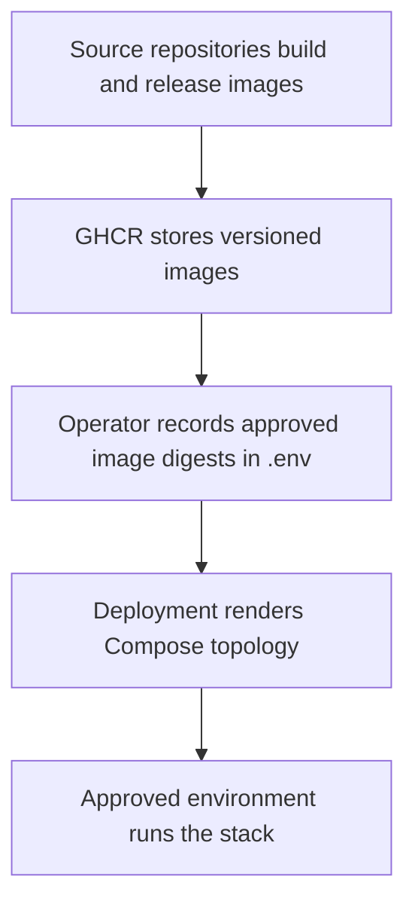

# Quick start

This repository assembles independently released GrooveMap service images. It
does not provide a source-development environment for those services.

## Prerequisites

- Git
- Docker Engine with Docker Compose v2
- [mise](https://mise.jdx.dev/) for the repository toolchain
- enough memory and storage for the selected stack and imported datasets
- approved manifest digests for every required GrooveMap image

## 1. Clone and validate

```bash
git clone https://github.com/groovemap-music/deployment.git
cd deployment
mise install
just setup
just check
```

The gate is credential-free and does not start containers. See the
[deployment validation guide](testing-guide.md) for its exact scope.

## 2. Configure immutable images

Create an untracked environment file:

```bash
cp .env.example .env
```

The example pins the currently approved source-repository releases. Review each
manifest before use; a future promotion must retain this form:

```dotenv
DATABASE_SCHEMA_IMAGE=ghcr.io/groovemap-music/database-schema@sha256:6831fa563e5a1b2dccb54fe2a86b64c084bb8d320d57fdd8ff65ace5b65eafa3
CATALOG_API_IMAGE=ghcr.io/groovemap-music/catalog-api@sha256:3483fb912c94f79076b4010043fb074eda3cdbb1299d3080887d6709590501d7
```

Tags alone and `latest` are rejected. See
[Container image standards](dockerfile-standards.md) for the complete ownership
map.

## 3. Review the rendered configuration

The base stack contains deliberate local-development credentials. Render and
review it before any start:

```bash
just config
```

For a production-shaped configuration, first generate untracked secret files:

```bash
just secrets-bootstrap
just config-prod
```

`just secrets-bootstrap` is idempotent, creates `secrets/` with restrictive
permissions, and never prints secret values. Supply any optional provider keys
before deploying. See [Configuration](configuration.md) and
[Docker security](docker-security.md).

## 4. Start only with operator approval

After reviewing the exact image digests, configuration, backup state, and
target environment, the approved operator may run:

```bash
just smoke
```

That command starts the stack and waits for service health. It is intentionally
excluded from CI and `just check`. Likewise, `just down` changes the live
environment and requires approval.

For a production overlay, use the reviewed Compose command appropriate to the
target environment:

```bash
docker compose -f docker-compose.yml -f docker-compose.prod.yml up -d --wait
```

## Service endpoints

The base configuration publishes these local endpoints:

| Component | Endpoint | Development credentials |
| --- | --- | --- |
| Operations console | <http://localhost:8003> | Application-specific |
| Catalog API | <http://localhost:8004> | Register through the API |
| Catalog API health | <http://localhost:8005/health> | None |
| Graph explorer | <http://localhost:8006> | None |
| Graph explorer health | <http://localhost:8007/health> | None |
| Neo4j Browser | <http://localhost:7474> | `neo4j` / `groovemap` |
| Neo4j Bolt | `localhost:7687` | `neo4j` / `groovemap` |
| PostgreSQL | `localhost:5433` | `groovemap` / `groovemap` |
| RabbitMQ management | <http://localhost:15672> | `groovemap` / `groovemap` |
| RabbitMQ AMQP | `localhost:5672` | `groovemap` / `groovemap` |
| Redis | `localhost:6379` | No base-stack password |

These credentials are for local development only. The production overlay uses
file-backed secrets and restricts exposed ports.

## Observe the stack

Use Compose to inspect status and logs:

```bash
docker compose ps
docker compose logs --tail=100
docker compose logs --tail=100 api
```

Follow logs only when interactive streaming is appropriate:

```bash
docker compose logs --follow api
```

Operational detail lives in the [Monitoring](monitoring.md),
[Administration](admin-guide.md), and [Troubleshooting](troubleshooting.md)
guides. Service-level development instructions live in each source repository.

## Repository map



The deployment repository is intentionally unversioned. Each source
repository versions its own artifact; an environment is identified by the full
set of promoted image digests.
