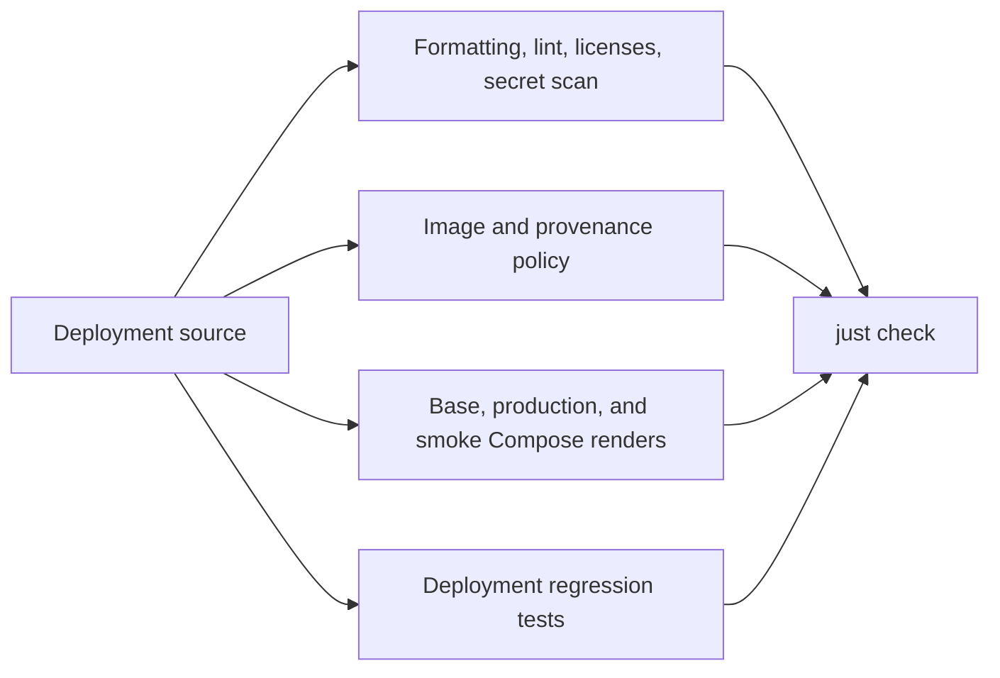

# Deployment validation guide

This repository validates the GrooveMap stack definition. It does not contain
service source code or service unit tests; those belong to the repositories
that build and publish each image.

## Required local gate

Run the same credential-free gate used by CI:

```bash
mise install
just setup
just check
```

`just check` performs all of the following without starting containers:

- verifies Ruff formatting and lint rules;
- enforces digest-pinned image inputs and repository ownership boundaries;
- checks the promoted extraction-rules and contract-fixture provenance records;
- checks dependency license policy;
- renders the base, production, infrastructure-smoke, and media-smoke Compose
  configurations, including the released-fixture overlay, using validation-only
  image digests;
- scans the Git history and worktree for leaked secrets;
- type-checks the Python validation scripts;
- runs deployment regression tests with coverage.

The full gate is the default before review. Focused commands are useful while
iterating:

| Command | Purpose | Starts containers |
| --- | --- | --- |
| `just default` | List the public recipe surface | No |
| `just setup` | Synchronize the locked development toolchain; may use the package network | No |
| `just source-check` | Static, policy, Compose-render, and secret checks | No |
| `just typecheck` | Type-check Python validation scripts | No |
| `just test` | Run deployment regression tests and collect script coverage | No |
| `just coverage` | Alias of `just test` | No |
| `just license-check` | Validate repository and dependency license policy | No |
| `just secret-scan` | Scan Git history and the worktree with redacted output | No |
| `just audit` | Query dependency vulnerability data; network-aware and scheduled separately | No |
| `just build` | Render all supported Compose combinations | No |
| `just install-check` | Alias of `just build`; deployment has no installable artifact | No |
| `just config` | Render the base configuration using the operator's `.env` | No |
| `just config-prod` | Render the production overlay using the operator's `.env` and secret paths | No |
| `just secrets-bootstrap` | Create missing untracked host secret files; changes local state | No |

`just config` and `just config-prod` can include sensitive effective values in
their output. Review them locally and do not attach an unredacted render to a
ticket or commit it.

## Validation flow



## Test ownership

| Concern | Owner |
| --- | --- |
| Compose topology, overlays, secrets wiring, and migration-script safeguards | `deployment/tests/deploy/` |
| The media assertion's fixtures, event translation, and isolation | `deployment/tests/deploy/test_media_smoke.py` |
| The erasure assertion's export parsing, absence probes, and isolation | `deployment/tests/deploy/test_erasure_smoke.py` |
| Image naming, digest pinning, and promoted-artifact provenance | `deployment/scripts/check-images.py` |
| Compose rendering for supported overlays | `deployment/scripts/check-compose.sh` |
| Service behavior, package behavior, and service Dockerfiles | The corresponding source repository |
| Database schema behavior and initializer image | [`database-schema`](https://github.com/groovemap-music/database-schema) |
| Shared CI behavior | [`.github`](https://github.com/groovemap-music/.github) |

## Validation-only image references

`config/validation.env` contains syntactically valid, non-published dummy
digests. They exist only so Docker Compose can resolve every required variable
during static configuration validation. They are not deployment inputs and
must never be copied into an environment `.env` file.

Real environments must use approved `ghcr.io/groovemap-music/<repository>`
references pinned with `@sha256:<manifest-digest>`.

The reviewed release digests are not kept in either environment file. They live
in `RELEASED_IMAGE_DIGESTS` in `scripts/check-images.py`, which is what
`just smoke-released` validates a candidate `.env` against.

## Live and performance checks

The following commands are intentionally outside `just check` and CI because
they can start containers, mutate an environment, or consume significant
resources:

| Command | Requirement |
| --- | --- |
| `just secrets-bootstrap` | Local authorization to create missing files under untracked `secrets/`; it never overwrites existing values |
| `just smoke` | Operator approval and real digest-pinned service images in `.env` |
| `just smoke-media` | Operator approval and real digest-pinned service images in `.env` |
| `just smoke-erasure` | Operator approval and real digest-pinned service images in `.env` |
| `just smoke-infra` | Operator approval to start the infrastructure smoke stack |
| `just smoke-released` | Operator approval and a reviewed `GM_RELEASED_STACK_ENV_FILE` containing approved digests for every internal image |
| `just smoke-released-fixture` | Operator approval and a reviewed `SMOKE_RELEASED_FIXTURE_ENV_FILE`; runs the published Discogs tiny fixture through RabbitMQ and both stores |
| `just performance` | Operator approval, a running target environment, and an approved performance-runner image |
| `just down` | Operator approval because it changes the current environment |

Do not use these commands as substitutes for the static gate. Record the exact
environment, image digests, and outcome when an operator approves a live test.
`just smoke-released` rejects mutable tags and validation-only digests before
starting containers, runs the schema initializer twice before applications,
waits for service health, exercises graceful consumer shutdown, and retains
service status and logs on failure.

`just smoke-released-fixture` is likewise outside pull-request CI: it pulls and
runs published containers, starts RabbitMQ, PostgreSQL, and Neo4j, and therefore
requires explicit operator approval. It creates the isolated Compose project
`groovemap-released-fixture-smoke`, exposes only RabbitMQ's management API on a
loopback port, and removes the project and its volumes on every exit. The run
accepts only the complete reviewed release set from `RELEASED_IMAGE_DIGESTS`.

The fixture itself is not duplicated in this repository. The digest-pinned
`discogs-ingestion` v0.3.1 image packages the versioned v1 manifest at
`/usr/share/discogs-ingestion/contracts/extractor-smoke/v1/manifest.json`.
The harness waits for the released Discogs graph and SQL consumers to bind,
runs that extractor manifest once, reads the image's pinned expected data event,
and polls PostgreSQL and Neo4j for its release, canonical media values, and
media relationships. This deployment slice complements rather than replaces
each service repository's real-engine integration tests.

### The canonical media and identifier assertion

`just smoke-media` is the end-to-end proof that ADR 0007's canonical `media` block
survives the whole path from a producer event to both stores, and that
[ADR 0011](https://github.com/groovemap-music/design/blob/main/docs/adr/0011-catalog-identifiers-and-manufacturing-credits.md)'s
identifier path survives it as far as a barcode a person can look up. It is a versioned
script rather than a runbook step, so both claims can be re-made on demand.

The identifier probes assert behaviour no reviewed image carries yet.
[Maintenance](maintenance.md#identifier-lookup-smoke-prerequisites) records which images
have to be released and reviewed first; until then those probes fail, and the failure is a
missing image rather than a broken stack.

**What the operator provides**: an untracked `.env` in which every `*_IMAGE` variable is an
approved `ghcr.io/groovemap-music/<repository>@sha256:<manifest-digest>` reference.
[Maintenance](maintenance.md) records the promoted digests. The script refuses to start if a
variable still holds an `.env.example` placeholder, a `config/validation.env` digest, or
anything not pinned by digest — a media assertion against images no environment runs would
prove nothing. `.env` is untracked and must never be committed.

**What it starts**: the schema initializer, RabbitMQ, PostgreSQL, Neo4j, both SQL loaders,
both graph enrichers, and the catalog API, under the Compose project
`groovemap-media-smoke` with `docker-compose.media-smoke.yml`. The extractors never run. A
smoke stack has no dumps to download, so the run publishes the release events itself. The
API is there for one request: a minted alias is only worth having if something resolves
through it, and the erasure smoke — the other stack that runs the API — has no broker and
no loaders, so it could only look up a row it had inserted itself.

**What it publishes**: the two producers' contract fixtures, promoted verbatim into
`config/media-smoke/` with their upstream repository, commit, and digest recorded in
`config/provenance.json`. The run rewrites only the identity fields the stores constrain —
the Discogs release id, the MusicBrainz release UUID, and the Discogs id the MusicBrainz
release matches on — and adds the Discogs release's country, which is a raw passthrough
field rather than a canonical block and so is absent from the producer's representative
fixture. It never edits the `media`, `identifiers`, or `companies` blocks. Each event is
published onto its producer's
durable fanout exchange through the RabbitMQ management API, after every contract queue has
bound a consumer, because a fanout exchange drops a message that reaches no queue.

**What it proves**:

- `releases.media` is populated for the Discogs fixture and its `families` match the block
  the producer published;
- `musicbrainz.releases.media` is populated for the MusicBrainz fixture and its `families`
  match that producer's block;
- Neo4j carries `Medium` and `MediaFamily` nodes joined by `IN_FAMILY`;
- the release is joined to its medium by `ISSUED_ON {source: 'discogs'}`, and by
  `ISSUED_ON {source: 'musicbrainz'}` once the MusicBrainz enricher matches it — which is
  what shows both catalogs' media reconciling onto one release node;
- exactly one currently valid `provider_aliases` row carries the normalized barcode, and
  its `native_id` is the `releases.gm_item_id` the published release resolved to;
- the release is credited to the pressing plant by
  `CREDITED_TO {role_category: 'pressing', source: 'discogs'}` and the `Company` node
  carries the name the event published;
- `Release.country` is the country the event published;
- `GET /api/lookup/barcode/<value as printed>` answers 200, normalises the value to the
  same `external_id` the alias is keyed on, and names the release.

The lookup probe deliberately sends the barcode **as printed**, grouping spaces and all.
The endpoint normalises with the namespace's own rule, and sending an already normalized
value would leave that rule untested.

Every assertion is polled to a deadline, because both loaders and both enrichers batch
their writes behind a flush interval. The run prints one `PASS`/`FAIL` line per assertion
and exits non-zero if any of them failed.

**What it leaves behind**: nothing. The run tears its own stack down with
`docker compose --project-name groovemap-media-smoke down --volumes --remove-orphans` from
an exit trap, including on failure. Its own project name is what keeps it away from an
operator's volumes; its own subnet, its own container names, and two loopback-bound ports —
the broker's management API and the catalog API — keep it away from a running environment.

**Knobs**, all optional and all environment variables: `SMOKE_MEDIA_PROJECT`,
`SMOKE_MEDIA_ENV_FILE`, `SMOKE_MEDIA_RABBITMQ_PORT`, `SMOKE_MEDIA_API_PORT`,
`SMOKE_MEDIA_TIMEOUT`,
`SMOKE_MEDIA_SUBNET`, and `SMOKE_MEDIA_SERVICE_PLATFORM`. The last one matters when the
workstation's architecture is not the one the internal images are published for; it applies
only to those services, so the broker and both stores stay native.

### The erasure and export assertion

`just smoke-erasure` is the end-to-end proof that [ADR 0010](https://github.com/groovemap-music/design/blob/main/docs/adr/0010-first-party-events-consent-and-deletion.md)'s
export and deletion claims hold: a real account's activity can be exported as well-formed
NDJSON, and after an erasure nothing keyed to that account survives in PostgreSQL, Neo4j, or
Redis. Like `just smoke-media`, it is a versioned script rather than a runbook step, so the
claim can be re-made on demand.

**What the operator provides**: an untracked `.env` in which every `*_IMAGE` variable is an
approved `ghcr.io/groovemap-music/<repository>@sha256:<manifest-digest>` reference, the same
requirement [`just smoke-media`](#the-canonical-media-and-identifier-assertion) has.
[Maintenance](maintenance.md) records the promoted digests. `scripts/smoke-erasure.sh` refuses
to start if a variable still holds an `.env.example` placeholder, a `config/validation.env`
digest, or anything not pinned by digest, and refuses an `.env` that declares no `*_IMAGE`
assignment at all — an assertion against images no environment runs would prove nothing.
`.env` is untracked and must never be committed.

**What it starts**: the schema initializer, PostgreSQL, Neo4j, Redis, and the catalog API,
under the Compose project `groovemap-erasure-smoke` with `docker-compose.erasure-smoke.yml`.
Naming the API pulls in its declared dependencies, so no extractor and no broker consumer
run: this assertion drives the API itself rather than a catalog ingest. PostgreSQL, Neo4j, and
Redis stay unpublished; the assertions reach them through `docker compose exec`. Only the
API's own health-gated port is published, on loopback.

**What it seeds**: the run registers a throwaway account against the disposable stack's own
API (email domain `smoke.invalid`, reserved by RFC 2606 so it can never be delivered to),
grants both published consent purposes (`product_analytics` and `model_training`), then
performs a search and a recommendation request so `activity.events` and
`activity.impressions` rows exist for the account. It asserts each store holds the account's
data *before* erasing — PostgreSQL for the activity, subject-link, and collection rows,
Neo4j for the account's `User` node and `COLLECTED` edge, and Redis for its recommendation and
snapshot keys — so an absence probe cannot later pass only because the seed silently never
happened.

**What it proves**:

- the export endpoint returns `application/x-ndjson`, one JSON object per line shaped
  `{"kind": …, "record": {…}}`, whose `kind` values are drawn from the documented export
  vocabulary and appear in the documented order, with at least one `event` line and one
  `impression` line;
- after erasure, `activity.events`, `activity.impressions`, and `activity.user_subjects` hold
  zero rows for the subject, and `activity.erasures` holds a row for it;
- `user_collections`, `owned_copies`, and `observations` hold zero rows for the account;
- the `users` row is soft-erased: its email carries the `erased+` prefix and `is_active` is
  `false`;
- no `User` node for the account remains in Neo4j;
- no `recommend:*` or `snapshot:usercount` Redis key for the account remains.

Every absence probe is scoped to the id this run created, never a bare count another run's
leftover row could satisfy in reverse.

**What it leaves behind**: nothing. `scripts/smoke-erasure.sh` tears the stack down with
`docker compose --project-name groovemap-erasure-smoke down --volumes --remove-orphans` from
an exit trap, including on failure, after printing container status and the API's logs for a
failed run. Its own project name, its own subnet, and a loopback-only API port keep it away
from a running environment, the same isolation `just smoke-media` uses.

**Knobs**, all optional and all environment variables: `SMOKE_ERASURE_PROJECT`,
`SMOKE_ERASURE_ENV_FILE`, `SMOKE_ERASURE_API_PORT`, `SMOKE_ERASURE_TIMEOUT`,
`SMOKE_ERASURE_SUBNET`, and `SMOKE_ERASURE_SERVICE_PLATFORM`. The last one matters when the
workstation's architecture is not the one the internal images are published for; it applies
only to the schema initializer and the API, so PostgreSQL, Neo4j, and Redis stay native.

`just check` and CI never run `just smoke-erasure`: it starts containers and mutates a live
account's data, so it requires the same operator approval as `just smoke-media` and the other
live checks below.

## Coverage

`just test` writes `coverage.xml` locally and prints missing lines. CI uploads
that report under the `deployment` Codecov flag. Coverage here measures the
deployment validation scripts only; service coverage remains with each source
repository.
