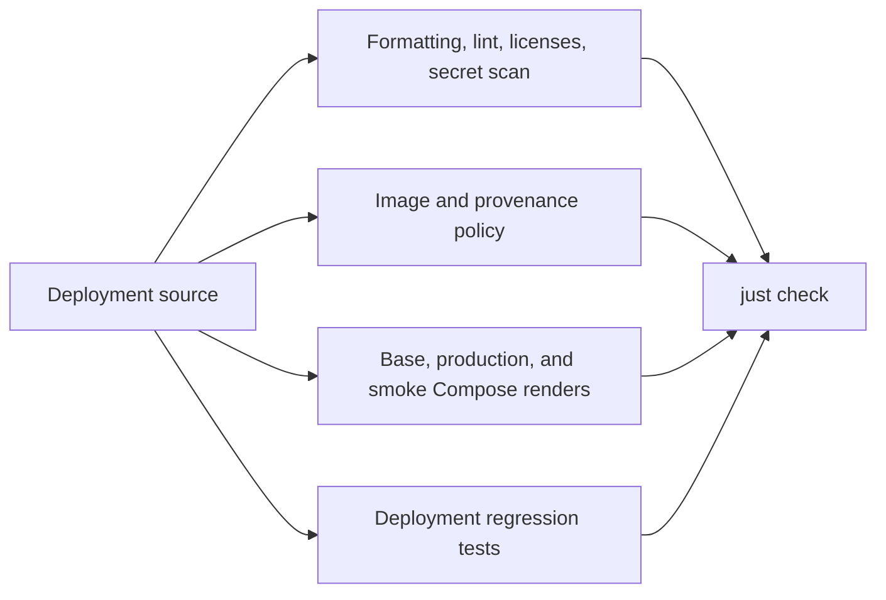

# Deployment validation guide

This repository validates the GrooveMap stack definition. It does not contain
service source code or service unit tests; those belong to the repositories
that build and publish each image.

## Required local gate

Run the same credential-free gate used by CI:

```bash
mise install
just setup
just check
```

`just check` performs all of the following without starting containers:

- verifies Ruff formatting and lint rules;
- enforces digest-pinned image inputs and repository ownership boundaries;
- checks the promoted extraction-rules and contract-fixture provenance records;
- checks dependency license policy;
- renders the base, production, infrastructure-smoke, and media-smoke Compose
  configurations using validation-only image digests;
- scans the Git history and worktree for leaked secrets;
- type-checks the Python validation scripts;
- runs deployment regression tests with coverage.

The full gate is the default before review. Focused commands are useful while
iterating:

| Command | Purpose | Starts containers |
| --- | --- | --- |
| `just source-check` | Static, policy, Compose-render, and secret checks | No |
| `just typecheck` | Type-check Python validation scripts | No |
| `just test` | Run deployment regression tests and collect script coverage | No |
| `just build` | Render all supported Compose combinations | No |
| `just config` | Render the base configuration using the operator's `.env` | No |
| `just config-prod` | Render the production overlay using the operator's `.env` and secret paths | No |

## Validation flow



## Test ownership

| Concern | Owner |
| --- | --- |
| Compose topology, overlays, secrets wiring, and migration-script safeguards | `deployment/tests/deploy/` |
| The media assertion's fixtures, event translation, and isolation | `deployment/tests/deploy/test_media_smoke.py` |
| Image naming, digest pinning, and promoted-artifact provenance | `deployment/scripts/check-images.py` |
| Compose rendering for supported overlays | `deployment/scripts/check-compose.sh` |
| Service behavior, package behavior, and service Dockerfiles | The corresponding source repository |
| Database schema behavior and initializer image | [`database-schema`](https://github.com/groovemap-music/database-schema) |
| Shared CI behavior | [`.github`](https://github.com/groovemap-music/.github) |

## Reviewed image references

`config/validation.env` pins the approved manifest digest for every released
service image. It lets Docker Compose resolve every required variable during
static configuration validation without pulling or starting those images.

Real environments must use approved `ghcr.io/groovemap-music/<repository>`
references pinned with `@sha256:<manifest-digest>`.

## Live and performance checks

The following commands are intentionally outside `just check` and CI because
they can start containers, mutate an environment, or consume significant
resources:

| Command | Requirement |
| --- | --- |
| `just smoke` | Operator approval and real digest-pinned service images in `.env` |
| `just smoke-media` | Operator approval and real digest-pinned service images in `.env` |
| `just smoke-infra` | Operator approval to start the infrastructure smoke stack |
| `just smoke-released` | Operator approval and a reviewed `GM_RELEASED_STACK_ENV_FILE` containing approved digests for every internal image |
| `just performance` | Operator approval, a running target environment, and an approved performance-runner image |
| `just down` | Operator approval because it changes the current environment |

Do not use these commands as substitutes for the static gate. Record the exact
environment, image digests, and outcome when an operator approves a live test.
`just smoke-released` rejects mutable tags and validation-only digests before
starting containers, runs the schema initializer twice before applications,
waits for service health, exercises graceful consumer shutdown, and retains
service status and logs on failure.

### The canonical media assertion

`just smoke-media` is the end-to-end proof that ADR 0007's canonical `media` block
survives the whole path from a producer event to both stores. It is a versioned script
rather than a runbook step, so the claim can be re-made on demand.

**What the operator provides**: an untracked `.env` in which every `*_IMAGE` variable is an
approved `ghcr.io/groovemap-music/<repository>@sha256:<manifest-digest>` reference.
[Maintenance](maintenance.md) records the promoted digests. The script refuses to start if a
variable still holds an `.env.example` placeholder, a `config/validation.env` digest, or
anything not pinned by digest — a media assertion against images no environment runs would
prove nothing. `.env` is untracked and must never be committed.

**What it starts**: the schema initializer, RabbitMQ, PostgreSQL, Neo4j, both SQL loaders,
and both graph enrichers, under the Compose project `groovemap-media-smoke` with
`docker-compose.media-smoke.yml`. The extractors never run. A smoke stack has no dumps to
download, so the run publishes the release events itself.

**What it publishes**: the two producers' contract fixtures, promoted verbatim into
`config/media-smoke/` with their upstream repository, commit, and digest recorded in
`config/provenance.json`. The run rewrites only the identity fields the stores constrain —
the Discogs release id, the MusicBrainz release UUID, and the Discogs id the MusicBrainz
release matches on — and never the media block. Each event is published onto its producer's
durable fanout exchange through the RabbitMQ management API, after every contract queue has
bound a consumer, because a fanout exchange drops a message that reaches no queue.

**What it proves**:

- `releases.media` is populated for the Discogs fixture and its `families` match the block
  the producer published;
- `musicbrainz.releases.media` is populated for the MusicBrainz fixture and its `families`
  match that producer's block;
- Neo4j carries `Medium` and `MediaFamily` nodes joined by `IN_FAMILY`;
- the release is joined to its medium by `ISSUED_ON {source: 'discogs'}`, and by
  `ISSUED_ON {source: 'musicbrainz'}` once the MusicBrainz enricher matches it — which is
  what shows both catalogs' media reconciling onto one release node.

Every assertion is polled to a deadline, because both loaders and both enrichers batch
their writes behind a flush interval. The run prints one `PASS`/`FAIL` line per assertion
and exits non-zero if any of them failed.

**What it leaves behind**: nothing. The run tears its own stack down with
`docker compose --project-name groovemap-media-smoke down --volumes --remove-orphans` from
an exit trap, including on failure. Its own project name is what keeps it away from an
operator's volumes; its own subnet, its own container names, and a single loopback-bound
broker port keep it away from a running environment.

**Knobs**, all optional and all environment variables: `SMOKE_MEDIA_PROJECT`,
`SMOKE_MEDIA_ENV_FILE`, `SMOKE_MEDIA_RABBITMQ_PORT`, `SMOKE_MEDIA_TIMEOUT`,
`SMOKE_MEDIA_SUBNET`, and `SMOKE_MEDIA_SERVICE_PLATFORM`. The last one matters when the
workstation's architecture is not the one the internal images are published for; it applies
only to those services, so the broker and both stores stay native.

## Coverage

`just test` writes `coverage.xml` locally and prints missing lines. CI uploads
that report under the `deployment` Codecov flag. Coverage here measures the
deployment validation scripts only; service coverage remains with each source
repository.
