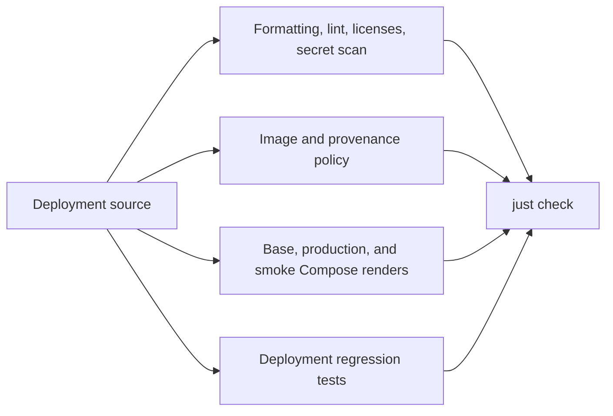

# Deployment validation guide

This repository validates the GrooveMap stack definition. It does not contain
service source code or service unit tests; those belong to the repositories
that build and publish each image.

## Required local gate

Run the same credential-free gate used by CI:

```bash
mise install
just setup
just check
```

`just check` performs all of the following without starting containers:

- verifies Ruff formatting and lint rules;
- enforces digest-pinned image inputs and repository ownership boundaries;
- checks the promoted extraction-rules provenance record;
- checks dependency license policy;
- renders the base, production, and smoke Compose configurations using
  validation-only image digests;
- scans the Git history and worktree for leaked secrets;
- type-checks the Python validation scripts;
- runs deployment regression tests with coverage.

The full gate is the default before review. Focused commands are useful while
iterating:

| Command | Purpose | Starts containers |
| --- | --- | --- |
| `just source-check` | Static, policy, Compose-render, and secret checks | No |
| `just typecheck` | Type-check Python validation scripts | No |
| `just test` | Run deployment regression tests and collect script coverage | No |
| `just build` | Render all supported Compose combinations | No |
| `just config` | Render the base configuration using the operator's `.env` | No |
| `just config-prod` | Render the production overlay using the operator's `.env` and secret paths | No |

## Validation flow



## Test ownership

| Concern | Owner |
| --- | --- |
| Compose topology, overlays, secrets wiring, and migration-script safeguards | `deployment/tests/deploy/` |
| Image naming, digest pinning, and extraction-rules provenance | `deployment/scripts/check-images.py` |
| Compose rendering for supported overlays | `deployment/scripts/check-compose.sh` |
| Service behavior, package behavior, and service Dockerfiles | The corresponding source repository |
| Database schema behavior and initializer image | [`database-schema`](https://github.com/groovemap-music/database-schema) |
| Shared CI behavior | [`.github`](https://github.com/groovemap-music/.github) |

## Reviewed image references

`config/validation.env` pins the approved manifest digest for every released
service image. It lets Docker Compose resolve every required variable during
static configuration validation without pulling or starting those images.

Real environments must use approved `ghcr.io/groovemap-music/<repository>`
references pinned with `@sha256:<manifest-digest>`.

## Live and performance checks

The following commands are intentionally outside `just check` and CI because
they can start containers, mutate an environment, or consume significant
resources:

| Command | Requirement |
| --- | --- |
| `just smoke` | Operator approval and real digest-pinned service images in `.env` |
| `just smoke-infra` | Operator approval to start the infrastructure smoke stack |
| `just smoke-released` | Operator approval and a reviewed `GM_RELEASED_STACK_ENV_FILE` containing approved digests for every internal image |
| `just performance` | Operator approval, a running target environment, and an approved performance-runner image |
| `just down` | Operator approval because it changes the current environment |

Do not use these commands as substitutes for the static gate. Record the exact
environment, image digests, and outcome when an operator approves a live test.
`just smoke-released` rejects mutable tags and validation-only digests before
starting containers, runs the schema initializer twice before applications,
waits for service health, exercises graceful consumer shutdown, and retains
service status and logs on failure.

## Coverage

`just test` writes `coverage.xml` locally and prints missing lines. CI uploads
that report under the `deployment` Codecov flag. Coverage here measures the
deployment validation scripts only; service coverage remains with each source
repository.
